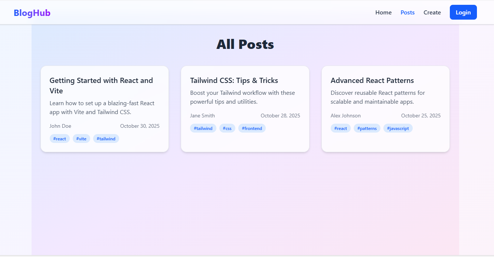

# BlogHub

BlogHub is a full-stack blogging platform built with React (Vite) for the frontend and Node.js/Express with MongoDB for the backend. It allows users to register, log in, create, edit, and view blog posts, as well as comment on posts.

---

## Table of Contents
- [Project Overview](#project-overview)
- [Features](#features)
- [Screenshots](#screenshots)
- [Setup Instructions](#setup-instructions)
- [API Documentation](#api-documentation)
- [License](#license)

---

## Project Overview
BlogHub is designed to be a simple yet powerful blogging platform. It supports user authentication, post management, categories, and comments. The frontend is styled with Tailwind CSS and communicates with the backend via RESTful APIs.

---

## Features
- User registration and login
- JWT-based authentication
- Create, edit, delete, and view blog posts
- Comment on posts
- Categorize posts
- Responsive UI with Tailwind CSS
- Protected routes for authenticated users

---

## Screenshots
Add screenshots of your application here. Example:




---

## Setup Instructions

### Prerequisites
- Node.js (v16+ recommended)
- MongoDB (local or Atlas)

### 1. Clone the repository
```powershell
# In PowerShell
git clone https://github.com/yourusername/bloghub.git
cd bloghub
```

### 2. Install dependencies
```powershell
cd server
npm install
cd ../client
npm install
```

### 3. Configure environment variables
Create a `.env` file in the `server` directory:
```
MONGO_URI=your_mongodb_connection_string
JWT_SECRET=your_jwt_secret
PORT=5000
```

### 4. Start the backend server
```powershell
cd server
npm start
```

### 5. Start the frontend client
```powershell
cd client
npm run dev
```

The client will run on `http://localhost:5173` and the server on `http://localhost:5000` by default.

---

## API Documentation

### Authentication
- `POST /api/auth/register` — Register a new user
- `POST /api/auth/login` — Login and receive JWT

### Posts
- `GET /api/posts` — Get all posts
- `GET /api/posts/:id` — Get post by ID
- `POST /api/posts` — Create a new post (auth required)
- `PUT /api/posts/:id` — Edit a post (auth required)
- `DELETE /api/posts/:id` — Delete a post (auth required)

### Comments
- `POST /api/posts/:id/comments` — Add a comment to a post (auth required)
- `GET /api/posts/:id/comments` — Get comments for a post

### Categories
- `GET /api/categories` — List all categories
- `POST /api/categories` — Create a category (auth required)

---

## License
MIT

---

## Credits
- React, Vite, Tailwind CSS
- Node.js, Express, MongoDB

---

> For more details, see the code in the `client` and `server` folders.
